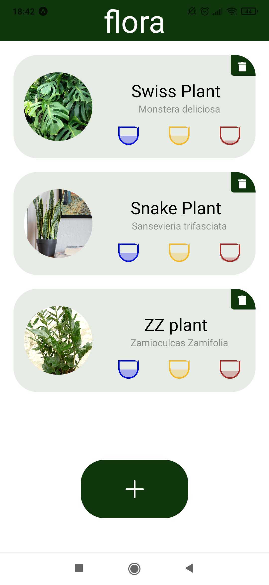

# Flora

Flora is an app that identifies plants using ML and provides users with the care instructions for the plants.

## Screenshots

<p float="left">
  
  
   
</p>

# Tech Stack

## Back-End

- TypeScript
- Node.js
- Express
- Sequelize (using PostgreSQL)

## Front-End

- React Native (Expo)
- TypeScript
- Redux
- Axios

# Setup

1. Clone repo

```
git clone https://github.com/jonbrook/flora.git
cd flora
```

2. Install dependencies

```
npm i && npm run install:subfolders
```

3. Create environment variable files

```
Create .env files using the examples in both the frontend and backend
```

4. Run database service

```
docker-compose up -d
```

5. Run backend

```
cd server && npm start
```

6. Run frontend

```
cd client && yarn start
```

7. Seed the database

```
cd server && npx sequelize-cli db:seed:all
```

# Features

- Worked in a team of 2 to refactor the code base of the application and make improvements on its functionality
- Refactored the application to TypeScript
- Modularized  the front end and added Redux to centralize the state  management on the store
- Added modularity in the back end by spreading the logic of the DB and its models across different files and improved the design by adding associations to existing Sequelize tables
- Implemented unit tests on both front end back end of the application, fully mocking the api service and redux hooks, using Jest, React Testing Library and Supertest

# Contributors 

- <a href="https://github.com/jonbrook">Jon Brook</a>
- <a href="https://github.com/KonGkal">Konstantinos Gkalitsas</a>
